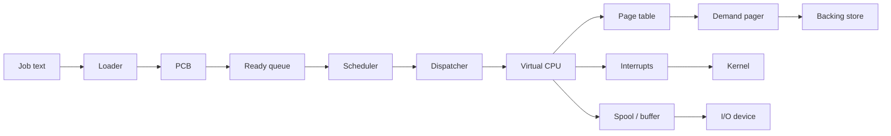
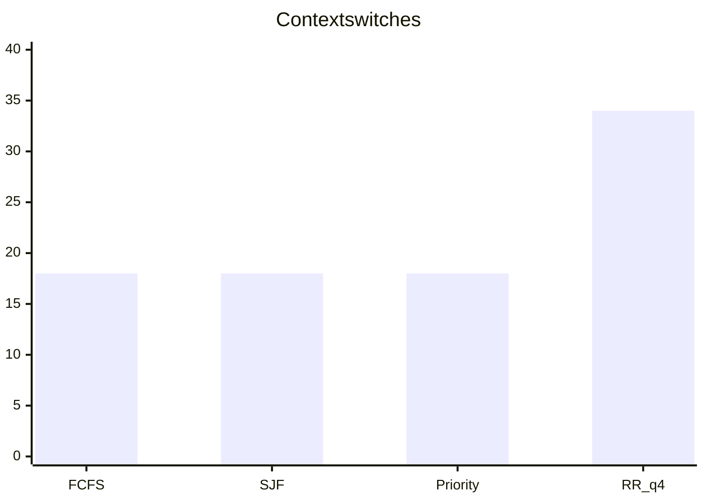

# Multiprogramming OS Simulator

Java 21 simulator of a small OS: virtual CPU, interrupts, PCBs, CPU scheduling,
demand paging, and spooled I/O. Algorithms share interfaces so they can be
compared on the same input.

Requires **JDK 21** and **Maven**.

```bash
mvn test
mvn -q -DskipTests compile
java -cp target/classes os.Main job src/main/resources/jobs/add.job
java -cp target/classes os.Main walkthrough
java -cp target/classes os.Main bench --output results
```

Windows: `scripts/demo.ps1`. Unix: `scripts/demo.sh`. CI runs `mvn test` and
uploads the JaCoCo HTML report (`target/site/jacoco`).

## Sample input / output

`src/main/resources/jobs/add.job`:

```text
JOB 1 PRIORITY 1
LOADI R0 10
LOADI R1 3
ADD R0 R1
STORE R0 20
HALT
END
```

```text
$ java -cp target/classes os.Main job src/main/resources/jobs/add.job
pid=1 halted pc=5 r0=13 mem[20]=13 retired=5
```

`walkthrough` prints a per-instruction CPU trace, one address translation,
a 3-process Gantt for four schedulers, and FIFO/LRU/Optimal on a 14-reference
string. Committed copy: [`docs/examples.txt`](docs/examples.txt).

## Architecture



Layout: `os.machine`, `os.interrupt`, `os.process`, `os.loader`,
`os.scheduling`, `os.memory`, `os.io`, `os.kernel`, `os.benchmark`.
Original 2022 labs stay in [`bin/`](bin/) and are not on the Maven classpath.
More detail: [`docs/design.md`](docs/design.md).

## Virtual CPU

32-bit words. `R0`–`R7` and a program counter. One `VirtualCpu.step()` is one
fetch-decode-execute cycle. User vs master mode.

| Bits | Field |
| --- | --- |
| 31..24 | opcode |
| 23..20 | register A |
| 19..16 | register B |
| 15..0 | immediate or address |

`LOADI`, `LOAD`, `STORE`, `MOVE`, `ADD`, `SUB`, `JUMP`, `JZ`, `SVC`, `HALT`,
`SET_TIMER` (master only). `LOAD`/`STORE` use word addresses. With paging,
those addresses go through the page table.

## Interrupts, PCBs, paging, I/O

- **Interrupts:** `SVC`, timer quantum, program fault (illegal opcode,
  privilege, bad address), I/O completion. Dispatch runs in master mode.
- **PCB:** pid, priority, program, state
  `NEW → READY → RUNNING → {READY, BLOCKED, TERMINATED}`, saved registers/PC.
- **Paging:** `VA = page × pageSize + offset`. A miss allocates a frame,
  writing a dirty victim back to the backing store first. That write-back is
  the swap path that exists today.
- **I/O:** bounded buffer, blocking device queue, spool that keeps a job if
  the device is full (`Spooler.drainOneTo`).

The kernel multiplexes scripted CPU/I/O bursts. It is not a hosted OS.

## Evaluation

Same generated inputs for every algorithm. Generators:
[`src/main/resources/workloads/`](src/main/resources/workloads/)
([`WORKLOADS.md`](WORKLOADS.md)).

**Scheduling** — 20 processes, seed `20260314`. FCFS, non-preemptive SJF,
Round Robin quantum 4, non-preemptive priority (lower number first).

Response time = first dispatch − arrival. A context switch is a
process-to-process dispatch (idle is not counted).

```mermaid
xychart-beta
    title Average response time (ticks)
    x-axis [FCFS, SJF, Priority, RR_q4]
    y-axis 0 --> 55
    bar [49.8, 31.6, 46.8, 28.15]
```



| Policy | Avg response | Avg wait | Avg turnaround | Switches |
| --- | ---: | ---: | ---: | ---: |
| FCFS | 49.800 | 49.800 | 56.100 | 18 |
| SJF | 31.600 | 31.600 | 37.900 | 18 |
| Priority | 46.800 | 46.800 | 53.100 | 18 |
| RR q=4 | 28.150 | 58.600 | 64.900 | 34 |

RR cuts average response **43.5%** vs FCFS and does more switches.

**Paging** — 1,000 refs, seed `20260315`, 12 pages, 4 frames. FIFO, LRU,
Optimal (Optimal sees the whole trace).

```mermaid
xychart-beta
    title Page faults / 1000 references
    x-axis [FIFO, LRU, Optimal]
    y-axis 0 --> 450
    bar [397, 396, 273]
```

| Policy | Faults | Hits | Fault rate |
| --- | ---: | ---: | ---: |
| FIFO | 397 | 603 | 39.7% |
| LRU | 396 | 604 | 39.6% |
| Optimal | 273 | 727 | 27.3% |

On this trace LRU is one fault better than FIFO; Optimal is clearly better.
FIFO is not always worse than LRU (see the 14-ref string in the walkthrough).

Raw files: [`results/`](results/). Method notes: [`docs/experiments.md`](docs/experiments.md).

## Limits

- ISA is this project's encoding, not a published course opcode sheet
- Optimal replacement is an oracle
- Kernel I/O bursts are data, not a real device model
- `bin/` holds standalone 2022 lab programs (including classmate folders)
