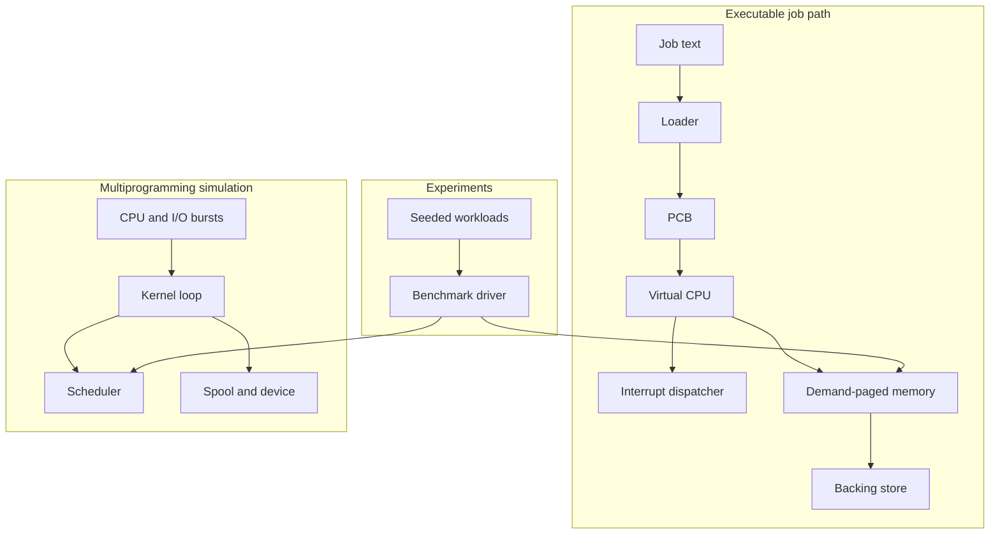
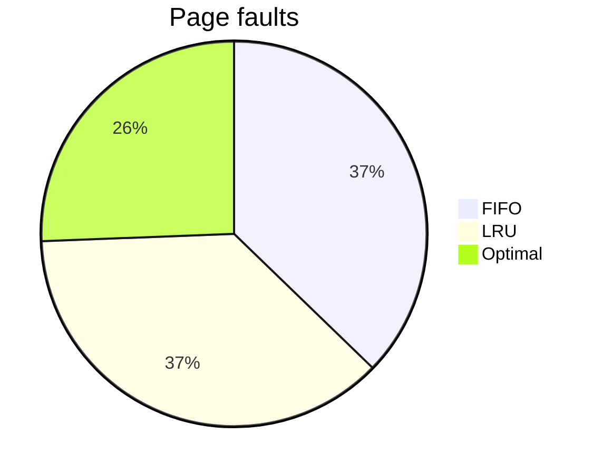

# Multiprogramming OS Simulator

Java 21 simulator of a small OS: virtual CPU, interrupts, PCBs, CPU scheduling,
demand paging, and spooled I/O. Algorithms share interfaces so they can be
compared on the same input.

Requires **JDK 21** and **Maven**.

```bash
mvn test
mvn -q -DskipTests compile
java -cp target/classes os.Main job src/main/resources/jobs/add.job
java -cp target/classes os.Main walkthrough
java -cp target/classes os.Main bench --output results
```

Windows: `scripts/demo.ps1`. Unix: `scripts/demo.sh`. CI runs `mvn test` and
uploads the JaCoCo HTML report (`target/site/jacoco`).

## Sample input / output

`src/main/resources/jobs/add.job`:

```text
JOB 1 PRIORITY 1
LOADI R0 10
LOADI R1 3
ADD R0 R1
STORE R0 20
HALT
END
```

```text
$ java -cp target/classes os.Main job src/main/resources/jobs/add.job
pid=1 halted pc=5 r0=13 mem[20]=13 retired=5 pageFaults=2
```

`walkthrough` prints a per-instruction CPU trace, one address translation,
a 3-process Gantt for four schedulers, and FIFO/LRU/Optimal on a 14-reference
string. Committed copy: [`docs/examples.txt`](docs/examples.txt).

## Architecture



Layout: `os.machine`, `os.interrupt`, `os.process`, `os.loader`,
`os.scheduling`, `os.memory`, `os.io`, `os.kernel`, `os.benchmark`.
Original 2022 labs stay in [`bin/`](bin/) and are not on the Maven classpath.
More detail: [`docs/design.md`](docs/design.md).

## Virtual CPU

32-bit words. `R0`–`R7` and a program counter. One `VirtualCpu.step()` is one
fetch-decode-execute cycle. User vs master mode.

| Bits | Field |
| --- | --- |
| 31..24 | opcode |
| 23..20 | register A |
| 19..16 | register B |
| 15..0 | immediate or address |

`LOADI`, `LOAD`, `STORE`, `MOVE`, `ADD`, `SUB`, `JUMP`, `JZ`, `SVC`, `HALT`,
`SET_TIMER` (master only). The `job` and `walkthrough` commands run the CPU
over `PagedVirtualMemory`; instruction fetches and `LOAD`/`STORE` therefore
go through the page table.

## Interrupts, PCBs, paging, I/O

- **Interrupts:** `SVC`, timer quantum, program fault (illegal opcode,
  privilege, bad address), I/O completion. Dispatch runs in master mode.
- **PCB:** pid, priority, program, state
  `NEW → READY → RUNNING → {READY, BLOCKED, TERMINATED}`, saved registers/PC.
- **Paging:** `VA = page × pageSize + offset`. A miss allocates a frame,
  writing a dirty victim back to the backing store first. That write-back is
  per-page backing-store I/O, not whole-process swapping.
- **I/O:** bounded buffer, blocking device queue, spool that keeps a job if
  the device is full (`Spooler.drainOneTo`).

The kernel multiplexes scripted CPU/I/O bursts. It is not a hosted OS.

## Four schedulers

Same ready queue; they only differ in **who runs next**. Non-preemptive
policies run until the CPU burst ends. Round Robin also stops at the quantum.

| Policy | Pick from ready | Preempt |
| --- | --- | --- |
| **FCFS** | arrived first (`readySequence`) | no |
| **SJF** | shortest remaining burst | no |
| **Priority** | smallest priority number | no |
| **RR** | arrived first, like FCFS | yes, after `q` ticks |

Demo (`os.Main walkthrough`): P1 at 0 burst 5, P2 at 1 burst 2, P3 at 1 burst 1.
SJF and priority match here because P3 is both shortest and highest priority.

```text
time    0  1  2  3  4  5  6  7  8
FCFS    P1 P1 P1 P1 P1 P2 P2 P3
SJF     P1 P1 P1 P1 P1 P3 P2 P2
PRIO    P1 P1 P1 P1 P1 P3 P2 P2
RR q=2  P1 P1 P2 P2 P3 P1 P1 P1
```

## Evaluation

Same generated inputs for every algorithm.
[`workloads/`](src/main/resources/workloads/) · [`WORKLOADS.md`](WORKLOADS.md).

**Scheduling** — 20 processes, seed `20260314`. Response = first dispatch −
arrival. Switch = process-to-process dispatch.

```text
Avg response
FCFS      #########################  49.8
SJF       ################           31.6
Priority  #######################    46.8
RR q=4    ##############             28.2

Context switches
FCFS      #########                  18
SJF       #########                  18
Priority  #########                  18
RR q=4    #################          34
```

| Policy | Avg response | Avg wait | Avg turnaround | Switches |
| --- | ---: | ---: | ---: | ---: |
| FCFS | 49.800 | 49.800 | 56.100 | 18 |
| SJF | 31.600 | 31.600 | 37.900 | 18 |
| Priority | 46.800 | 46.800 | 53.100 | 18 |
| RR q=4 | 28.150 | 58.600 | 64.900 | 34 |

RR response is **43.5%** below FCFS; SJF wins wait/turnaround; RR pays in
switches and wait.

Quantum sensitivity on the same 20 processes:

| Quantum | Avg response | Avg wait | Avg turnaround | Switches |
| ---: | ---: | ---: | ---: | ---: |
| 2 | 15.300 | 62.600 | 68.900 | 63 |
| 4 | 28.150 | 58.600 | 64.900 | 34 |
| 8 | 44.850 | 52.450 | 58.750 | 21 |

Smaller quanta improve first response here, but increase switches and total
waiting. The reported RR result is therefore configuration-specific.

**Paging** — FIFO evicts oldest frame, LRU the least recently used, Optimal
the page whose next use is farthest (needs the full trace). 1,000 refs, seed
`20260315`, 12 pages, 4 frames.



```text
Page faults
FIFO      ####################  397
LRU       ####################  396
Optimal   ##############        273
```

| Policy | Faults | Hits | Fault rate |
| --- | ---: | ---: | ---: |
| FIFO | 397 | 603 | 39.7% |
| LRU | 396 | 604 | 39.6% |
| Optimal | 273 | 727 | 27.3% |

On this trace LRU is one fault better than FIFO; Optimal is clearly better.
FIFO is not always worse than LRU (see the 14-ref string in the walkthrough).

Raw files: [`results/`](results/). Method notes: [`docs/experiments.md`](docs/experiments.md).

## Future work

The main remaining step is to join the two execution paths above:

- execute each kernel process as virtual instructions instead of scripted bursts
- surface page faults as kernel interrupts that can block and wake a process
- add per-process address spaces, protection checks, and optionally a small TLB
- route `SVC` output through the spooler
- model whole-process swap separately from current per-page write-back

Optimal replacement remains an offline oracle. The standalone programs in
`bin/` remain historical material rather than simulator modules.
